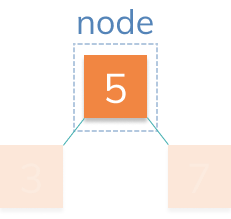

# Creating a Node

Let's first create the class Node, from which we will create each element inside of our tree:



The node should contain data, which in this case is `5`. It should also contain references to the left child `(3)` and the right child `(7)`.

## 🏁 Your Goal: Complete Constructor

Complete the constructor function on the node. Store the `data` inside a `data` property on the instance.

Store `null` in properties `left` and `right`.

Usage Example:

```js
const node = new Node(5);

console.log(node.data); // 5
console.log(node.left); // null
console.log(node.right); // null
```

## 🧪 Run Test

Access this path in your terminal and run the following command:

```bash
yarn test
```

or 

```bash
yarn mocha ./src/test.js
```