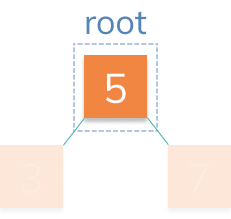

# Storing the Root

Now it's time to create our Tree! 🌲

A tree will keep track of one property: a reference to the `root` node.



The node should contain data, which in this case is `5`. It should also contain references to the left child `(3)` and the right child `(7)`.

## 🏁 Your Goal: Store the Root

Finish the constructor function on the `Tree` class in the new file `Tree.js`.

All you need to do for now is store `null` on a `root` property.

```js
const tree = new Tree();

console.log(tree.root); // null
```

## 🧪 Run Test

Access this path in your terminal and run the following command:

```bash
yarn test
```

or 

```bash
yarn mocha ./src/test.js
```