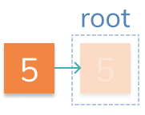

# Adding a Root

In this stage we'll create a new method for adding nodes to our tree. This is a difficult task to generalize so we'll attack it piece by piece!

First let's start by **`adding a root`** to an empty tree.



## 🏁 Your Goal: Add Node Method

Create a new method `addNode` on `Tree` which will take a new `node` and add it to the tree.

Assume that the tree is empty for this stage. Simply set the root to be the node passed into the method.

```js
// create a new tree and new node
const tree = new Tree();
const node = new Node(5);

// add the node to the tree using addNode
tree.addNode(node);

// the new node becomes the tree's root
console.log(tree.root.data); // 5
```

> 🧠 In the next few stages we'll start to generalize this function, so it won't hurt to start thinking in that direction!

## 🧪 Run Test

Access this path in your terminal and run the following command:

```bash
yarn test
```

or 

```bash
yarn mocha ./src/test.js
```