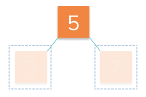

# First Layer

Now it's time to focus on adding the first layer of nodes underneath our root!

> 🍂 The bottom-most layer of a tree is call it's **`leaves`** 🍃

Keep the code you used to pass the last stage and then add another case for when a root already exists:



When the root already exists, we'll need to decide which side to add the new leaf node to.

👈 If the new node `data` is **`less than`** the root data, we'll want to add it to the **`left`**.

Conversely, if the data is **`greater`** we'll add it to the **`right`**. 👉

## 🏁 Your Goal: Modify Add Node

Modify the `addNode` function to **`also`** handle adding the first children of the `root`.

```js
const tree = new Tree();
const node1 = new Node(5);
const node2 = new Node(3);
const node3 = new Node(7);

tree.addNode(node1);
tree.addNode(node2);
tree.addNode(node3);

console.log(tree.root.left.data); // 3
console.log(tree.root.right.data); // 7
```

> ⚠️ Don't worry about generalizing this any further than the first `left` and `right` children just yet! We'll focus on that in the next stage.

## 🧪 Run Test

Access this path in your terminal and run the following command:

```bash
yarn test
```

or 

```bash
yarn mocha ./src/test.js
```