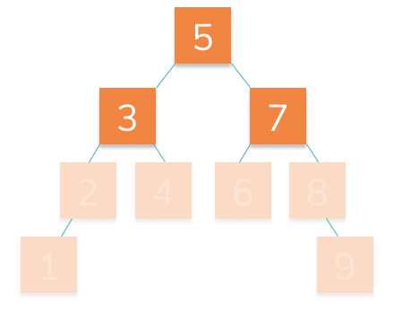

# Generalizing

Now it's time to make our `addNode` function work for many layers of the tree:



> 🔍 You can do this iteratively or recursively! For help on designing your solution, check out details.

## 🏁 Your Goal: Modify Add Node

Complete the function `addNode` so that it can handle adding nodes no matter how large the tree gets.

> 😫 Don't worry if you start to get frustrated! This is a tough stage. It may take you several tries to get it right.

## 🧪 Run Test

Access this path in your terminal and run the following command:

```bash
yarn test
```

or 

```bash
yarn mocha ./src/test.js
```