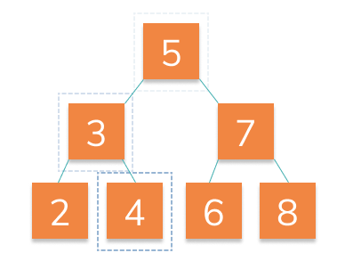
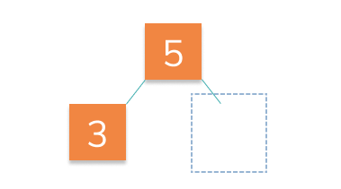

# Search Tree

It's time to reap the rewards of creating our binary search tree. That's right, it's time to **`search`**!

Let's use the sort order to find nodes in the tree. For instance, if we were searching for the node 4:



1. We start at the root `5`, recognize that `4` is less than `5` so we move left. 👈

2. We find `3`, recognize that `4` is greater than `3` so we move right. 👉

3. We find `4`, recognize this is what we are looking for and return `true`.

If we search for a missing node, we return `false`.

For instance if we were looking for `7` on this tree:



☝️ After recognizing that 7 is greater than 5, we attempt to move right, but there is no right node! We return false.

## 🏁 Your Goal: hasNode Method

Add a method `hasNode` that will take a `number` and search our tree to find a node that has that number inside it's `data` property.

If a node exists with the `number`, return `true`. If not return `false`.

For example:

```js
const tree = new Tree();
const node1 = new Node(4);

tree.addNode(node1);

console.log(tree.hasNode(4)); // true
console.log(tree.hasNode(7)); // false
```

## 🧪 Run Test

Access this path in your terminal and run the following command:

```bash
yarn test
```

or 

```bash
yarn mocha ./src/test.js
```