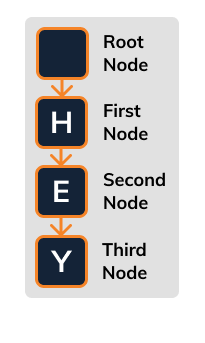

# Trie & Trie Node

We're going to create two data structures for the first stage. The **`Trie`** and **`TrieNode`**.

The Trie will represent the entire data structure, while the **`TrieNode`** will represent each letter in the structure.

Let's see this in a simple example:



☝️ This single trie data structure has **`four nodes`**. It has a root node, which points to a node with the key `h`, which points to a node with the key `e`, which points to a node with the key `y`.

## 🏁 Your Goal: Constructors

Implement the `constructor` function for both the `Trie` and `TrieNode` class.

For each `TrieNode` instance, add four properties:

1. `key` - This will be passed to the node, it is the letter stored as a string
2. `children` - This will be an object, containing the children elements, by default set it to an empty object
3. `isWord` - This will be a boolean, whether or not the node finishes a word, set it to `false` by default.

For each `Trie` instance, add a **`single property`**:

1. `root` - This will be an instance of `TrieNode` that contains a `null` key. The `null` key will indicate that this is the top parent in the list.

> ✅ Be sure to store these properties on `this` so they are accessible for every instance of the class.

## 🧪 Run Test

Access this path in your terminal and run the following command:

```bash
yarn test
```

or 

```bash
yarn mocha ./src/test.js
```