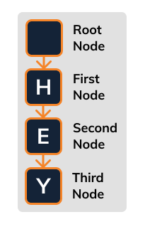
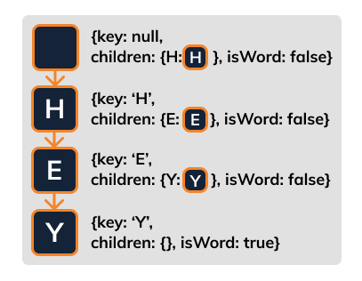

# Simple Trie Insert

Let's focus on that example from the previous stage:



To create this trie, we would simply do this:

```js
trie = new Trie();
trie.insert('HEY');
```

In fact, if you look at the test cases, that's exactly what it does!

Let's see the data we're expecting in our nodes:



☝️ Here, the box inside the JSON indicates a reference to the other node.

The root node stores a reference to the `H` node in its `H` key of its children property.

The first node stores a reference to the `E` node in its `E` key of its children property.

> ⚠️ Notice that only the last node `Y` has set the `isWord` to `true`! This property should indicate if the node is the end of a word.

## 🏁 Your Goal: Link the Nodes

Add a new function called `insert` on the `Trie` class.

This function will take a string word like `"hey"`. Split this word up by character and create nodes for each character.

Link the nodes `children` property as indicated in the above image.

> 🧐 Be sure to also update the properties `isWord` property.

## 🧪 Run Test

Access this path in your terminal and run the following command:

```bash
yarn test
```

or 

```bash
yarn mocha ./src/test.js
```