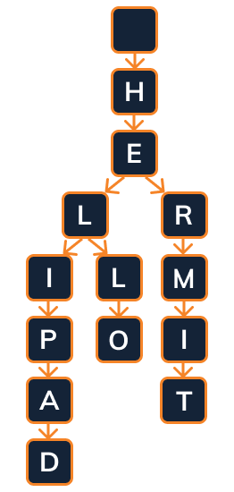

# Branching

An important aspect of the trie is its ability to branch and have many children. Let's take a look at a larger example:



☝️ In this example, both the letter `E` and the first `L` will have two children.

The data for the `E` would be:

```js
{
    key: "E",
    isWord: false,
    children: {
        'L': lNode,
        'R': rNode,
    }
}
```
☝️ Here the `hNode`, `lNode`, and `rNode` are object references to those particular nodes.

> 🧐 In the above example, there are three nodes that should have `isWord` set to true. They are `D`, `O` and `T`.


## 🏁 Your Goal: Link the Nodes

Add branching to the `insert` function. When a second child comes up, be sure to add it as well.

> ✅ Depending on how you implemented your logic on the previous stage, you may already be passing the test cases!

## 🧪 Run Test

Access this path in your terminal and run the following command:

```bash
yarn test
```

or 

```bash
yarn mocha ./src/test.js
```