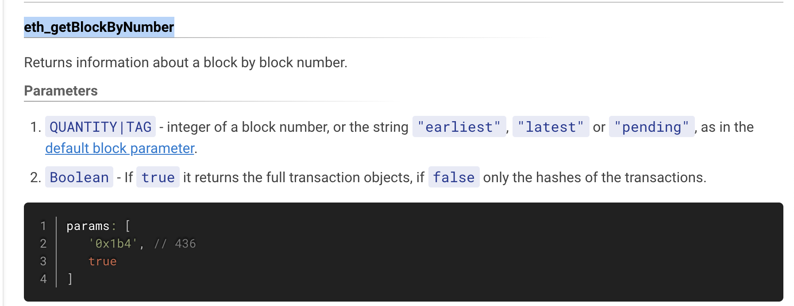

# Activity: JSON-RPC Read Requests!

## Activity Requirements

**THE TIME HAS COME... TO SET UP AN [ALCHEMY](https://www.alchemy.com/?a=dkdaniz) ACCOUNT**


**Congrats, web3 developer and passionate AU colleague.** You've made it to a key point in the AU content: creating an Alchemy account!

Quick recap: **What does Alchemy do?** Alchemy is a web3 development platform that provides services including connections to high-uptime Ethereum nodes for developers... Your Alchemy account will give you access to key features such as:

- creating an HTTP URL to an Ethereum node on the network of your choice
- analytics for your web3 dApp
- other development goodies like [Enhanced APIs](https://www.alchemy.com/enhanced-apis?a=dkdaniz), the [NFT API](https://www.alchemy.com/nft-api?a=dkdaniz) and the [Alchemy SDK](https://www.alchemy.com/sdk?a=dkdaniz)

**Follow these steps below or check out [this video](https://www.youtube.com/watch?v=tfggWxfG9o0) to get set up with a RPC URL:**

1. Go to [Alchemy](https://www.alchemy.com/?a=dkdaniz) and sign up for an account
2. Once you are in the dashboard, select Create App
3. Name your app and choose your app's settings (choose a testnet!)
4. Select View Key
5. Copy either the API KEY or the HTTP URL provided
6. Paste into your local development project (you'll see how in this activity below!)

You now have a fully-powered connection to an Ethereum node, congratulations!

## Activity Intro - What is JSON-RPC?

[JSON-RPC](https://www.jsonrpc.org/specification) is a way to send and receive JSON-formatted messages between a client and a server. Here is a sample JSON-RPC request to an Ethereum node, which acts as a server:

```js
{
    "jsonrpc":"2.0",
    "method":"eth_getBalance",
    "params":["0x407d73d8a49eeb85d32cf465507dd71d507100c1", "latest"],
    "id":0
}
```

> JSON stands for `JavaScript Object Notation` RPC stands for `Remote Procedure Call`

We are making a request to the Ethereum blockchain to return the balance of a specific address at the most recent block.

You can even try making a JSON-RPC request in your own command line. Open a terminal, copy-paste and run:

```
curl -X POST --data '{"jsonrpc":"2.0","method":"eth_blockNumber","params":[],"id":83}' https://eth-mainnet.alchemyapi.io/v2/gZgOOh1X3cpVWXeVR9EL51zC1vpbggIF
```

If you are running Windows, you will need to formulate this request just a bit differently by not using single quotes and escaping the inner double ones. Try running:

```
curl -X POST --data “{\“jsonrpc\”:\”2.0\”,\”method\”:\”eth_blockNumber\”,\”params\”:[],\”id\”:83}” https://eth-mainnet.alchemyapi.io/v2/gZgOOh1X3cpVWXeVR9EL51zC1vpbggIF
```

The response will look something like this:

```js
{
    "jsonrpc": "2.0",
    "id": 83,
    "result": "0xc30ba7" // block number in hex format, 12782503
}
```

Ethereum Full Nodes can provide access for queries and transactions by running a JSON-RPC API. You can form queries like: running transactions, querying address balances, or deploying a new contract! Very cool.

We will use JSON-RPC to start interacting with the Ethereum blockchain!

# Instructions

The [Ethereum JSON-RPC API](https://ethereum.org/en/developers/docs/apis/json-rpc/) is an interface that will allow us to write programs that use an Ethereum client as a gateway to the Ethereum computer network.

1. Create Project Structure

- In your terminal, in the folder of your choice, `run mkdir alchemyu-json-activity && cd alchemyu-json-activity`
- Run `npm init -y`
- Run `npm install axios`
- Run `touch index.js`

> [Axios](https://axios-http.com/) is a library for making HTTP requests in a heartbeat! It is applicable across all of software development, not just web3.

In the `index.js` file, copy-paste the following:

```js
const axios = require("axios");

// copy-paste your URL provided in your Alchemy.com dashboard
const ALCHEMY_URL = "";

axios
  .post(ALCHEMY_URL, {
    jsonrpc: "2.0",
    id: 1,
    method: "eth_getBlockByNumber",
    params: [
      "0xb443", // block 46147
      false, // retrieve the full transaction object in transactions array
    ],
  })
  .then((response) => {
    console.log(response.data.result);
  });
```

- Notice, you'll need to copy-paste your Alchemy HTTPS endpoint - if you haven't already done so, [check out this quick start guide](https://docs.alchemy.com/docs/alchemy-quickstart-guide?a=dkdaniz) for more in-depth instructions on setting up Alchemy.

> Feel free to choose whichever network you like today, including mainnet, as we will only be structuring READ-only queries.



Notice the script above is already set up with a request: [eth_getBlockByNumber](https://docs.alchemy.com/reference/eth-getblockbynumber?a=dkdaniz).

Try running it (remember to save the file!) by running `node index` - you should see the contents of mainnet block #46147 printed out on your console.

2. Run the Axios Request With Another Method!
   Now that we have a file setup and it is successfully querying the Ethereum blockchain via JSON-RPC, pick a different method from the [Ethereum JSON-RPC API](https://docs.alchemy.com/reference/ethereum-api-quickstart?a=dkdaniz) and plug it into your script!

Remember, you'll need to re-structure the script to account for the new method. Particularly, the `params` will most likely be different per method call.

- Change the `method` value to the method you want to use
- Change the `params` value to what that method calls for parameters in the specs

Practice as many READ queries as you can. You are making read queries to the Ethereum computer like a champ... how cool is that?

# 🧪 Run Project ethereum-json-rpc-activity

1. Define your alchemy api key in the env file.
2. Rename .env.example to .env

Access ethereum-json-rpc-activity folder in your terminal and run the following command:

```bash
yarn start
```

or

```bash
source .env && node index.js
```
