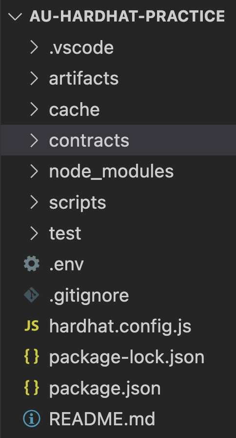

# Activity: Deploy a Contract with Ethers.js + Hardhat

In this activity, we'll run through deploying a contract to the Göerli test network. We will deploy a live ether faucet on Göerli - you can choose to deploy any contract you'd like or customize the one below however you like! 🚰

It's great to get some practice in with leading web3 development like Hardhat, let's jump in! 👨‍🔧👩‍🔧

> These activities are meant to teach you how to work more on your local. Setting up a local development environment is something that becomes extremely easy with a lot of practice! 🏋️‍

## Activity Requirements
[Apex](https://apexwallet.xyz/): Browser extension wallet that provides key storage and secure account log-in as well as acts as a JSON-RPC gateway.
[Alchemy](https://www.alchemy.com/): Alchemy is a blockchain development platform from which we will use some APIs to help query the Ethereum blockchain.
[Hardhat](https://hardhat.org/): Ethereum developer suite full of tools that make the developer experience more efficient.

## Setup

### 1. Acquire Göerli ETH

- You can get some testnet ether at https://goerlifaucet.com/

## Instructions

### 1. Create Project Structure
1. Open up a generic terminal
2. In your preferred root folder, run `mkdir au-deployContract && cd au-deployContract`
3. run `npm init -y`
4. run `npm install --save-dev hardhat`
5. run `npm install @nomicfoundation/hardhat-toolbox chai '@nomiclabs/hardhat-etherscan ethers dotenv`

As review, the above commands do the following:

- `npm init -y`: sets up an empty package.json
- `npm install ethers`: installs the ethers.js library
- `npm install dotenv`: installs a package that allows us to use sensitive data as environment variables in our project
- `npm install hardhat`: plugs in the `hre` global access to our project so that we can use Hardhat features throughout it

> ⚠️ If you see a bunch of warnings `like npm WARN deprecated` appear on your terminal when you are installing dependencies, don't worry about them! They are a common part of npm installs and there is little you can do about them.

### 2. Add files, **`.env`** and run **`npx hardhat`**

1. Run `touch .env` (this creates a brand new `.env` file in your current directory), then open in and add in your **`Göerli`** private key as a variable
2. **This time, also add your Alchemy `GOERLI_URL` as a variable in your `.env` file!**
3. Save and close the file
4. Run `npx hardhat`
5. Select `Create a JavaScript project`and select `y` to everything!
6. This is labelled below, but remember to add `require('dotenv').config()` to the top of your `hardhat.config.js` file!

> This will get you set up with all of the hardhat dependencies that you might need! 🏗🦺



You'll now have a basic project structure set up with a `contracts` and `scripts` folder and some sample files in them, just like above. Go ahead and delete only the files in them, we won't be needing them - but we do need the folders, so keep those!

Ok, now that we've got a basic Hardhat project structure set up, let's start implementing a contract and a deployment script! 💥

### 3. Edit **`hardhat.config.js`**

In the `hardhat.config.js` that Hardhat set up for us, we'll want to make some modifications - for now, just delete everything in it and copy-paste the following:

```js
require("@nomiclabs/hardhat-waffle");
require("dotenv").config();

module.exports = {
  solidity: "0.8.4",
  networks: {
    goerli: {
      url: process.env.GOERLI_URL,
      accounts: [process.env.PRIVATE_KEY]
    },
  }
};
```

We are setting a compiler version and enabling hardhat to run commands to the Göerli network!

### 4. Add A Smart Contract File

We'll be deploying a generic faucet contract on Göerli - anyone will be able to send and withdraw some ether, just like the typical faucets we use to acquire Göerli. 🚰

1. `cd` into your `contracts` folder and run `touch Faucet.sol`
2. Open the `Faucet.sol` file and copy-paste the following contents:
   
```js
//SPDX-License-Identifier: Unlicense
pragma solidity ^0.8.0;

contract Faucet {
  
  function withdraw(uint _amount) public {
    // users can only withdraw .1 ETH at a time, feel free to change this!
    require(_amount <= 100000000000000000);
    payable(msg.sender).transfer(_amount);
  }

  // fallback function
  receive() external payable {}
}
```
3. Save the file!
   

The Faucet contract is quite simple; it allows anyone to call the `withdraw` method and specify an amount lower than .1 ETH at a time. The `receive` fallback function will handle any ETH deposited into the Faucet and add it to the contract balance.

### 5. Add Scripts

Now, we need to create a script that will run the methods provided by `ethers.js` in order to deploy` Faucet.sol` to the Göerli test network.

We will need **one** script:

- deployment script

We don't need a whole deployment script anymore! Hardhat does all this work for us now!

1. In your `scripts` directory, run touch `deploy.js`
2. Open the newly-created file and copy-paste the following:

```js
const ethers = require('ethers');
require('dotenv').config();

async function main() {

  const url = process.env.GOERLI_URL;

  let artifacts = await hre.artifacts.readArtifact("Faucet");

  const provider = new ethers.providers.JsonRpcProvider(url);

  let privateKey = process.env.PRIVATE_KEY;

  let wallet = new ethers.Wallet(privateKey, provider);

  // Create an instance of a Faucet Factory
  let factory = new ethers.ContractFactory(artifacts.abi, artifacts.bytecode, wallet);

  let faucet = await factory.deploy();

  console.log("Faucet address:", faucet.address);

  await faucet.deployed();
}

main()
  .then(() => process.exit(0))
  .catch(error => {
    console.error(error);
    process.exit(1);
});
```
> 🧠 Remember, we are using our Alchemy key as always - but imported from our .env file using process.env

### 6. Deploy Your Faucet!

**`All systems are go!`** We should now be ready to run the final commands in order to deploy our own faucet to Göerli.

First, compile the `Faucet.sol` with Hardhat so that all the necessary artifacts are created...

1. Run `npx hardhat compile`
You should now see an artifacts folder pop up in your project directory - search through it to spot your contracts abi and bytecode!
2. To deploy, run `npx hardhat run scripts/deploy.js --network goerli`
Notice we used the `--network` flag above? This is where our changes in `hardhat.config.js` come in, we are telling Hardhat to run this command in our predefined network which is Göerli.
3. You should now see your newly-deployed contract address as terminal output - nice!
4. Copy-paste that address into https://goerli.etherscan.io/ and check out your contract in live deployment form!
Can you think of any extra features to add to your faucet? How about some sort of way of keeping track of user addresses that have already used it? Or using timestamps to limit mass withdrawals all at once?

Did you notice Hardhat make things easier for us as developers? Or maybe harder? 👀

# My Contract

link: https://goerli.etherscan.io/address/0x251A182100892dacDa2A1e6a4AA71B875732a04a