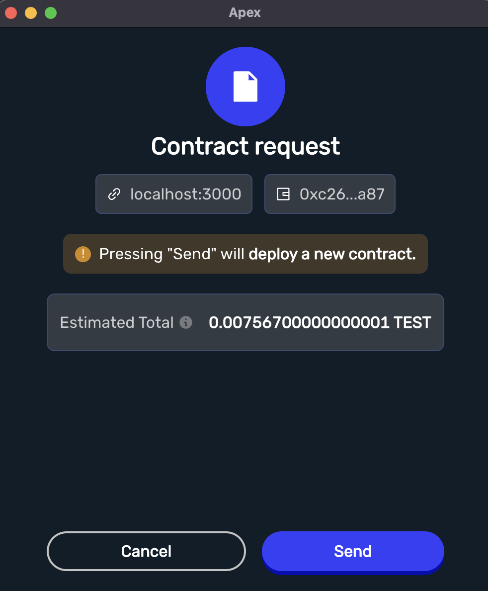

# Decentralized Escrow Application
Now that you have built the Decentralized Escrow Smart Contract, it's time to pull it together with a React front-end web application so we can interact with it!

### 🏗️ Setting Up
In this section we'll look into getting setup with the Escrow dApp!

## Step 1: Cloning the repository! 👨‍💻👩‍💻

The Decentralized Escrow Application can be found here: https://github.com/alchemyplatform/escrow-hardhat.git

This project has 2 pieces to it:

- A Hardhat project is confgiured in the base directory of the escrow project. We'll be using hardhat tooling to write, test and deploy our contracts.
- A React frontend `/app` directory which is in the project's base directory.
If you already have Git installed you can simply run the following command:

```
git clone https://github.com/alchemyplatform/escrow-hardhat.git
```
If you don't have Git installed, don't worry! You can go directly to the Github link above and click on the "Clone or download" button to download a zip of the repository. Unzip this repository into a directory on your machine.

> 📖 Git is a distributed source control system. It provides a way to save code changes in increments (called commits) and keep a history of all the changes. If you are not familiar with Git, there are many learning resources online including the [git documentation!](https://git-scm.com/doc)

## Step 2: Installing the dependencies ⏳

You will need to open up a terminal and navigate to the Escrow root directory. From there you will need to install the project's node dependencies. You will also need to navigate in to the project's app directory where the React frontend lives and install dependencies there too.

```
cd path/to/escrow/folder && npm install && cd app && npm install
```
This may take a moment. ⏱

## Step 3: Running a Local Test Blockchain ⛓️

To keep things simple we are going to start our own local blockchain and test our code locally.

To keep things simple, we are going to test on a local blockchain! You can follow the rough steps below, which use the Hardhat command line interface, or check out [this guide for a full set up of Hardhat with a browser wallet.](https://www.web3.university/article/how-to-build-a-react-dapp-with-hardhat-and-metamask)

You can start your local blockchain with

```
npx hardhat node
```

☝️ With that the blockchain is up and running with network id 31337 (aka: chain id). This blockchain will respond to test JSON RPC calls on your localhost port 8545 (http://localhost:8545/)! You should see some output that looks like this:

```
Started HTTP and WebSocket JSON-RPC server at http://127.0.0.1:8545/

Accounts
========
Account #0: 0xf39fd6e51aad88f6f4ce6ab8827279cfffb92266 (10000 ETH)
Private Key: 0xac0974bec39a17e36ba4a6b4d238ff944bacb478cbed5efcae784d7bf4f2ff80

Account #1: 0x70997970c51812dc3a010c7d01b50e0d17dc79c8 (10000 ETH)
Private Key: 0x59c6995e998f97a5a0044966f0945389dc9e86dae88c7a8412f4603b6b78690d
```

☝️Starting a local Hardhat node will create 20 test accounts loaded with 10000 Ether on your local ethereum blockchain. You're rich! 💸 Keep this terminal running because you'll need the seed phrase or a private key for the next step!

## Step 4: Install Apex Wallet & Add a Custom RPC Network
Apex Wallet is a crypto wallet that can be installed as an add-on for your web browser! This allows us to sign and broadcast messages without leaving the browser itself. You can install [Apex here](https://apexwallet.xyz/).

When developing locally with any browser wallet you'll want to configure the browser wallet to about your locally running blockchain. [This guide for a full set up of Hardhat with a browser wallet](https://www.web3.university/article/how-to-build-a-react-dapp-with-hardhat-and-metamask). The intstructions will generally work with most browser wallets.

You can take any private key from the list of private keys above the mnemonic and import it into your Apex wallet. Follow these steps to import a private key:

1. Select the profile dropdown in the top left corner
2.Select Import with Private Key
3. Copy-paste a private key from one of the accounts given to you by your local Hardhat node you ran in your terminal
4. You should see your account balance now be 100 of whatever you called your custom token! 🤯
   
## Step 5: Compile the Contract 📜

It's time to compile the Escrow Smart Contract! If you look in the repository you downloaded from Github you will see a `/contracts` folder. Inside here is the Escrow Smart Contract. Feel free to replace this with the one that you built! 😁

> ⚠️ Getting errors? You might have forgotten to run **`npm install`** in the root-level of your project!

The contracts can be compiled with Hardhat. All you need to do is run:

```
npx hardhat compile
```

☝️ Run this in a terminal window that is inside your escrow repository directory. It will compile the smart contract and output the ABI and bytecode in an **`artifact`** in the `/app/src` directory so our front-end application can deploy Escrow Smart Contracts!

> 📖 The **`artifact`** output location is configured by the `hardhat.config.js` file in the top-level of the project. You can learn more about compile contracts and artifacts [here](https://hardhat.org/hardhat-runner/docs/guides/compile-contracts).

## Step 6: Run the Front-End with React 📦

Finally, it's time to run our application! We'll be using [React](https://reactjs.org/).

> Oh you thought this was purely a web3 course? No way! We are now going to look at front-end development so that you become a well-rounded software developer all-around! 🚀

To get the React front-end running, follow these steps:

1. `cd` into the `/app` directory and run `npm install`
2. To run the front-end application run `npm start` from the `/app` directory.
3. Open http://localhost:3000 to view it in your browser.

> ⚠️ At this point, you might have to **`disable`** any other web3 wallets you use. If any other wallet extension pops up when you load your app that isn't Apex, just disable that specific extension and re-load the page. You should see Apex Wallet load! 💥

## 🎬 Interact With Your dApp

Once you have the application up and running its time to create some Escrow Contracts!

**Fill Info 📝**
You should see three inputs for the `arbiter`, `beneficiary` and `deposit` amount. These should look familiar! You just built these constructor arguments into the Escrow Smart Contract. Now we have a user interface for accepting these arguments to deploy a new Escrow!

If you followed the steps above you should have a few accounts with ether. You can copy these addresses into the `arbiter` and `beneficiary` fields. The account that you are currently signed in as will be the `depositor`.

Finally, for the deposit you can enter an amount in Wei. Perhaps you'd like to send 1 ETH? That would be `1000000000000000000 wei`.

> Remember the EVM reads ETH values in the lowest ether denomination: **`wei`**!

Be sure that your account has enough ether in it to cover the deposit you just entered - it should because you connected your local blockchain and added a private key loaded with 100 ETH on it!

## Deploy An Escrow Contract Instance 🚀

Once you have filled in these fields, you can click `Deploy`!

This should pop up a transaction request on the Apex Wallet widget:



Click `Send` to sign the transaction and broadcast it to your local network.

If successful, this should create a new existing contract on the right-hand side of the screen. 💯

## Approve the Escrow as the Arbiter ✅

Now, it's time for the arbiter to `approve` the escrow!

You'll need to switch to the arbiter's address in order to approve the transaction, otherwise it will revert the transaction!

> 🔒 Due to the smart contract code, only the `arbiter` can call the `approve` function! Remember when you built that into the contract? A good bit of security! 😁

Approve the transaction as the `arbiter`. ✅

On success, the `Approved` event should trigger the existing contract to say **`"It's been approved!"`**. ✅

## ⚔️ Challenges For You To Implement

We've helped you set up with a very basic dApp. Now it's time for you to challenge yourself and extend this dApp's functionality. These are challenges for you to extend on the decentralized application!

> The possibilities are endless!

## Challenge 1: Run the dApp on a Live Testnet 🌐
Try running the Escrow dApp on the Göerli testnet. This involves you deploying the smart contract to the Göerli test network.

> Need an Alchemy endpoint in order to deploy to a testnet? [Get one here](https://alchemy.com/?a=dkdaniz).

You can acquire some testnet ether via Alchemy's [Göerli Faucet](https://goerlifaucet.com/).

Then you can change the network on Apex Wallet to point at the testnet of your choosing. From there, simply deploy and interact with the contract as you did on the local testnet!

## Challenge 2: Stylize 🎨

Make the application your own! Change the HTML around and play with the CSS. Add some JavaScript.

**`Make the best looking decentralized escrow application anyone has ever seen!`**

## Challenge 3: Wei to Ether Conversion 💱

Is Wei really user friendly? Perhaps we should accept the deposit as ether instead of wei.

In this case, you'll need to do the conversion inside of the application code, before the contract's deployment!

## Challenge 4: Persistence 💾

When you refresh the page, all the escrow smart contracts are gone! 😱

It would be nice if we could keep track of all smart contracts that have been deployed. We could do this by creating a server that keeps track of all the deployed Escrow Smart Contracts. Either that or a page that can interface with any Escrow contract given a particular address.

## Challenge 5: What else? 🤔

What else can be done with the Decentralized Escrow Application?

Is there something that can be added to the Escrow Contract? If so, feel free to change the `Escrow.sol` in` /contracts` and make sure to test it afterwards by running `npm run test`!

## 📖 Further Research

The `arbiter` is a stand-in for perhaps a more complex mechanism that can arbitrate a transaction. What do we mean by this? 🤔

Well, what if, instead of having an arbiter, you could **`prove`** that goods were sent to a recipient? Then you wouldn't need the arbiter to approve the address. If it is a digital transaction you could tie into that transaction directly.

Another thing to consider: what if the `arbiter` wasn't a single person, but an organization which could sign off on a transaction? This may make more sense for larger transactions.

To conclude, we've helped you set up a very minimal skeleton dApp - fully functional, but still needs so so many features! Go ahead and be creative, build the best escrow dApp the world has ever seen! 🚀
