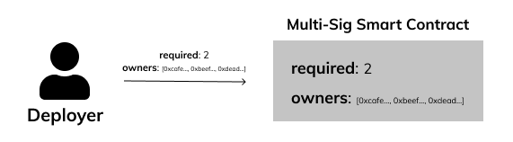

# Pay the Bill

## 🏁 Your Goal: Setup

Let's create a Multi-Sig Wallet!

When this wallet is deployed it will be configured with the owners addresses and how many signatures are required to move funds.

## 📦 State Variables

1. Declare a public `address[] owners` to store wallet owner addresses.
   
2. Declare a public `uint256 required` to store the required amount of confirmations needed to execute a transaction.

## 🏗️ Constructor

3. Define a constructor function that has two parameters: an array of owner addresses and the `uint256` required amount of confirmations.
   
4. Store the two arguments in their respective state variables created above.



## 🧪 Run Test

Access this path in your terminal and run the following command:

```bash
yarn test
```

or

```bash
yarn mocha ./src/test.js
```
