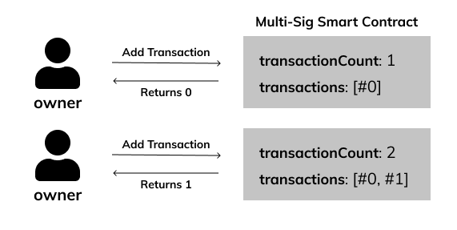

# Transactions

You built out the storage for the transactions. 📦

Now it's time we create a function to put our transactions into that storage!

## 🏁 Your Goal: Add Transactions

1. Define a public addTransaction function with a destination address and a value uint256 as parameters.
2. This function should create a new transaction struct and add it to the transactions storage variable
3. This function should return a uint256 transaction id to reference this particular transaction (see note below).
4. Set the executed boolean should be set to false by default.
   
## 📒 Note on Transaction IDs

The transaction IDs should be zero-based. The first one being `0`, then `1`, `2`, and so on.



☝️ In the first `addTransaction`, the transaction #0 is added and the `transactionCount` becomes `1`.

In the next `addTransaction`, the transaction #1 is added and the `transactionCount` becomes `2`.

## 🧪 Run Test

Access this path in your terminal and run the following command:

```bash
yarn test
```

or

```bash
yarn mocha ./src/test.js
```
