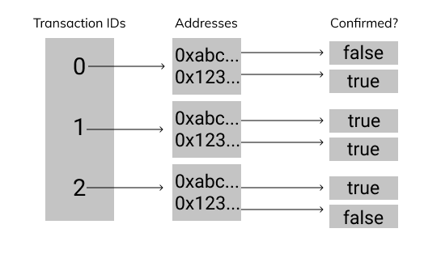

# Confirmations Storage 📦

Since each transaction is only executed after all confirmations are received, we will need to implement a way to check which owners have confirmed a transaction!

Let's create the storage variable for the confirmations before diving into the functionality.

## 🏁 Your Goal: Nested Confirmations Mapping

Define a public `confirmations` mapping which maps the transaction id (`uint`) to an owner (`address`) to whether or not they have confirmed the transaction (`bool`).



☝️ A transaction id maps to a mapping of address to booleans.

The first transaction (#0) maps to two addresses, one of which has confirmed the transaction. The second transaction (#1) maps to two addresses where both have confirmed the transaction.

## 🧪 Run Test

Access this path in your terminal and run the following command:

```bash
yarn test
```

or

```bash
yarn mocha ./src/test.js
```
