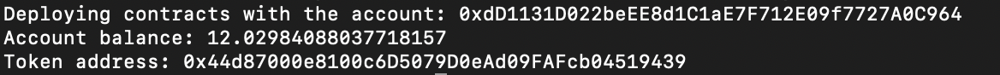

# How to Deploy Your Own ERC-20 Token

In this guide, we'll be setting up an ERC-20 token on the Goerli test network - start thinking what name you would like to name your very own ERC-20!

## Guide Requirements

- [Hardhat](https://hardhat.org/): Hardhat is an Ethereum development platform that provides all the tools needed to build, debug and deploy smart contracts.
- [Alchemy](https://alchemy.com/?a=eth-bootcamp): Alchemy is a blockchain development platform from which we will use some APIs to help query the Ethereum blockchain.
-[Göerli Testnet Ether](https://goerlifaucet.com/)

## Step 1: Set Up Project

This local project will require you use an Alchemy API key, retrivable [here](https://university.alchemy.com/course/ethereum/md/alchemy.com/eth-bootcamp). Then, follow these instructions to set up the project:

1. In a folder of your choice, run mkdir `[NAME OF YOUR HARDHAT PROJECT]`
2. `cd` into that project
3. Run `npm init -y`
4. Run `npm install dotenv` (super important, if you don't feel fresh on `.env`, it's very important!)
5. Run `npm install --save-dev hardhat`
6. Run `npx hardhat` then select your preferences...

## Step 2: Set Up .env

In your project's root folder:

1. un `touch .env`
2. Open the `.env` file and copy-paste the following contents:

```bash
ALCHEMY_GOERLI_URL=
RINKEBY_PRIVATE_KEY=caed4r3d92c1548cf7536c290e6a1871757fb5fea5721dea3a08c6d4abcd16cf
ETHERSCAN_KEY=
SOME_OTHER_VARIABLE=
```
3.Copy-paste your Alchemy HTTP Endpoint to the `ALCHEMY_GOERLI_URL` variable declaration above!

Remove the sample private key from above and copy-paste your own (from the account you loaded with Goerli ETH in Step #3) - we only included it as an example of what a variable should look like in the `.env` file

You can export your Goerli private key by going to MetaMask then Select the menu icon in top right then `Account Details` then `Export Private` Key...

> Be **`extremely`** careful at this step. NEVER share your private keys with anybody ever!!

Notice, in your `.env`, there is no need for "" or ; - just paste the value directly after the `=`.

Now, any file that loads the .env file by placing `require('dotenv').config();` at the top will have access to the variables in that file by via `process.env`! Awesome.

Your `hardhat.config.js` will now work and load the .env variables and values correctly!

## Step 3: Set Up ERC-20 Contracts And Scripts

1. For this guide, you will need the @openzeppelin/contracts package! Run `npm install @openzeppelin/contracts`
   
2. Now, it is time to name your token! 😱 In the next step, you will create your contract file - you must match the name of your smart contract file with the name of your token, so if you choose `GoofyGooberToken`, you must name your contract file `GoofyGooberToken.sol`.

For this guide and since Alchemy University is full of true Goofy Goobers, we will go with `GoofyGoober` for our token name (the same as above, just without the "Token") - thus, we will name our contract `GoofyGoober.sol`:

`cd` into your `/contracts` folder (which should be empty right now!), and run touch `GoofyGoober.sol`

> Follow along if you want to create a GoofyGoober token like us but also feel free to replace the name with yours and make your own token!

3. Open the newly-create .sol file and copy-paste the following:

```soldiity
//SPDX-License-Identifier: MIT
pragma solidity ^0.8.0;

import "@openzeppelin/contracts/token/ERC20/ERC20.sol";

contract GoofyGoober is ERC20 {
    uint constant _initial_supply = 100 * (10**18);
    constructor() ERC20("GoofyGoober", "GG") {
        _mint(msg.sender, _initial_supply);
    }
}
```

> The token symbol you choose, in our case "GG" can be any arbitrary character length but do keep in mind that some UIs may display ones that are too long differently.

4. If you are going with an ERC-20 of your own name (you should!), make sure to change all the Goofy Goober references to match the name of your `.sol` file
5. Feel free to edit the initial supply by changing the `100` to how many tokens you would like your initial supply to be - we put 100 because there are very few true Goofy Goobers in the world! You can put any number you'd like for this - make sure to leave the `(10**18)` as that multiplies the number we want as our supply to have 18 decimals.
Save and close the file
Now that we've got a whole contract set up, let's create the deployment script for it!

6. `cd ..` back into your project root directory and then `cd` into your `scripts` directory (which should be empty right now!)
7. Run `touch deploy.js`, open the newly-created file and copy-paste the following:
   
```javascript
async function main() {
  const [deployer] = await ethers.getSigners();

  console.log("Deploying contracts with the account:", deployer.address);

  const weiAmount = (await deployer.getBalance()).toString();
  
  console.log("Account balance:", (await ethers.utils.formatEther(weiAmount)));

  // make sure to replace the "GoofyGoober" reference with your own ERC-20 name!
  const Token = await ethers.getContractFactory("GoofyGoober");
  const token = await Token.deploy();

  console.log("Token address:", token.address);
}

main()
  .then(() => process.exit(0))
  .catch((error) => {
    console.error(error);
    process.exit(1);
});
```

8. Just one action item: replace the reference to "GoofyGoober" in the file if you went with another name for your ERC-20 token
9. Save and close the file
10. `cd ..` back into your project root directory
    
## Step 4: Deploy Your ERC-20 Token!

1. Run `npx hardhat run scripts/deploy.js --network goerli`
2. Your contract will be compiled and deployed to the Goerli network! You should see something similar to this in your terminal output:
formatEther



1. Go to https://goerli.etherscan.io/ and input your outputted Token address to see your deployed ERC-20 contract on Goerli!
Now it's time to have the real fun! Send some of your new tokens to your friends and family, stimulate an economy - create the Bitcoin/Ethereum of the future! In this guide, you deployed your own ERC-20 token on Goerli using the OpenZeppelin ERC20 standard - great job!

## Step 5: Send Some Tokens!

We are going to challenge you to send some tokens in one of two ways:

1. **`More Challenging Way`**: Write your own Hardhat Script to do an airdrop!
2. **`Simpler Way`**: Add your ERC-20 token to MetaMask and send it to an address via the UI!

## 🧪 Run Script

Access this path in your terminal and run the following command:

### RUN DEPLOY AND AIRDROP


```bash
yarn airdrop
```

### RUN ONLY DEPLOY

```bash
yarn mocha ./src/test.js
```