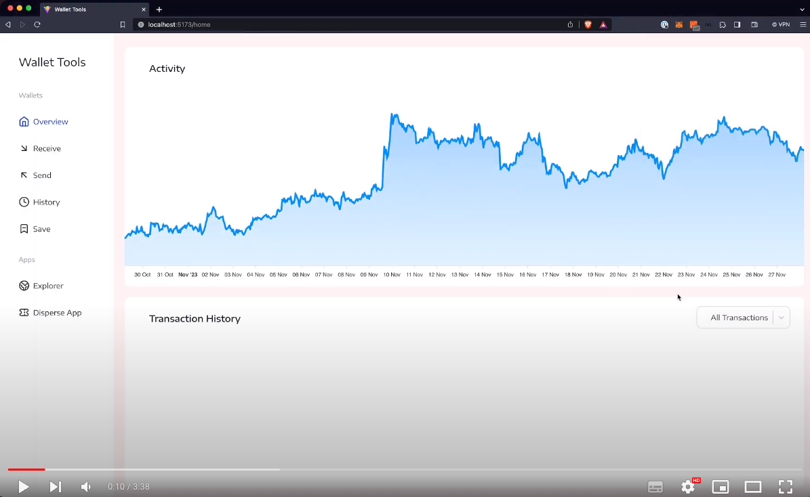

# Wallet Tools

Is an essential tool for the intelligent management of ethers and tokens. With it, we can carry out transactions efficiently, consult the detailed history and even avoid mistakes by saving your favorite addresses for future transactions. In the Apps section, two DApps have already been developed: - Explorer, which allows you to check all ERC20, ERC721 and ERC1155 tokens in your wallet or in selected ones, - Disperse, a DApp that simplifies the distribution of ERC20 and ether tokens to multiple addresses, providing significant fee savings.

# Links

[Figma - Prototype](https://www.figma.com/proto/29ZxOVzGeMGBS13C5RTiYd/Wallet-Tools?page-id=0%3A1&type=design&node-id=205-194&viewport=1540%2C1214%2C0.47&t=rt3UQ6GvFqFVks9j-1&scaling=scale-down&starting-point-node-id=205%3A194)

[Figma - Design](https://www.figma.com/file/29ZxOVzGeMGBS13C5RTiYd/Wallet-Tools?type=design&node-id=0-1&mode=design)

[Live project](https://wallet-tools.vercel.app)

## Preview

